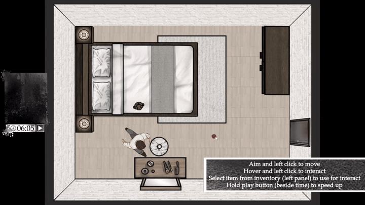
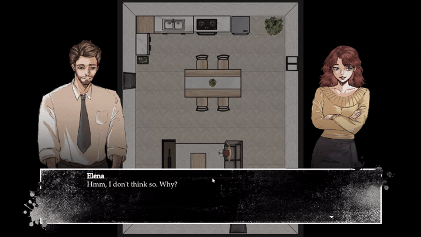
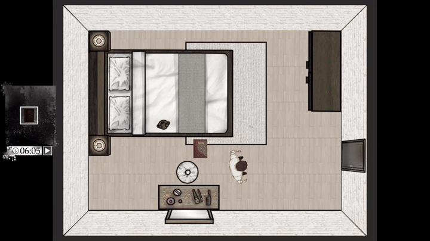
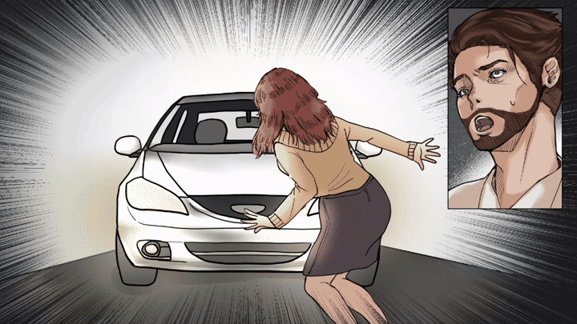
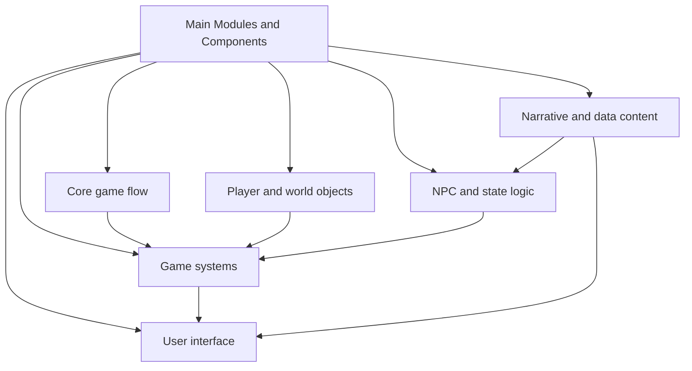
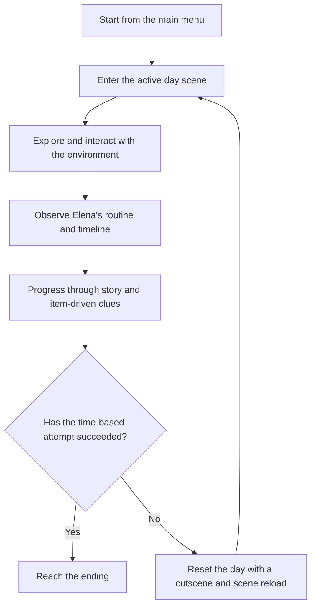

<h1 align="center">⏰ One More Day 🚪</h1>

## Overview 🌐

A narrative puzzle game about a husband trapped in a time loop after losing his wife in a mysterious accident. The game blends character scheduling, inventory management, dialogue scenes, and room-to-room navigation into a single repeating gameplay loop where the player tries to influence events and uncover the correct path forward.

<table border="0" cellpadding="0" cellspacing="0" style="border: none; border-collapse: collapse;">
    <tr>
        <td width="50%" style="border: none;"></td>
        <td width="50%" style="border: none;"></td>
    </tr>
    <tr>
        <td width="50%" style="border: none;"></td>
        <td width="50%" style="border: none;"></td>
    </tr>
</table>

Made by **B-Free**:
 - Maximillian Kenas
 - Janice Sandia Kurniawan
 - Jennie Aurellia

| Name | Contributions |
| --- | --- |
| Maximillian Kenas (**Game Programmer**) | Created all core game mechanics and systems |
| Janice Sandia Kurniawan (**Game Artist**) | Created all 2D assets used across the project |
| Jennie Aurellia (**Game Designer**) | Shaped the game design and direction, created game contents and story |

### Time spent: 30 Days 📅 / 160 Work Hours ⌛

## Key Features ✨

- Loop-based progression and reset system
  - The game tracks loop count and restart conditions through the global game manager.
  - Each failed or incomplete day can reset with a cutscene and reload, creating a sense of repetition and mystery.

- NPC routine simulation
  - Elena follows a scripted daily schedule built around states such as cooking, eating, showering, dressing, putting on makeup, making a phone call, and leaving the house.
  - Her behavior is controlled by a state machine and tied to room transitions and interactable objects.

- Room-based exploration and navigation
  - The player moves through connected rooms using door transitions and navigation logic.
  - Movement, seating, facing direction, and room awareness are handled as core gameplay systems.

- Inventory and item interaction
  - The inventory manager tracks selected and collected items and supports item-based progression.
  - Objects in the world are designed to be interacted with and can influence the story or the state of the day.

- Dialogue-centered storytelling
  - The project includes a dialogue system, response UI, phone logs, and narrative text assets.
  - Story beats are delivered through conversation, cutscenes, and event-driven triggers.

- UI and presentation systems
  - The game includes pause menus, settings, cutscene overlays, hint prompts, phone UI, diary-style interfaces, and time tracking elements.
  - Audio and transition managers support the overall flow between scenes and moments.

- Save, settings, and scene management
  - Autoload managers handle transitions, scene switching, audio playback, and local save state.
  - Settings and game persistence are stored in a structured, reusable system.

## Main Modules and Components 🧩

The project is organized into these main areas:

- `src/`     # Main game code, organized into shared utilities, game objects, game systems, scenes, and UI.
- `assets/`  # Visual, audio, font, animation, tilemap, and interface resources used by the game.
- `data/`    # External game content such as dialogue and item definitions.
- `addons/`  # The addons used for the game.

Modules and Components Structure:

### 1. Singletons

| Path | Purpose |
| --- | --- |
| `src/common/autoload/game_manager.gd` | Handles loop state, restart logic, ending logic, and main scene transitions. |
| `src/common/autoload/scene_manager.gd` | Manages scene changes across the game. |
| `src/common/autoload/save_manager.gd` | Saves and loads persistent data for the game. |
| `src/common/autoload/transition_manager.gd` | Controls transitions, fades, and reload behavior. |

### 2. Player and world objects

| Path | Purpose |
| --- | --- |
| `src/game_object/player/player.gd` | Main player controller. |
| `src/game_object/player/player_interaction.gd` | Handles interaction logic with nearby objects. |
| `src/game_object/camera/camera.gd` | Manages camera behavior in the active scene. |
| `src/game_object/trigger_area/*` | Includes restart, teleport, and room boundary triggers. |
| `src/game_object/interactable/*` | Environment objects such as doors, breakfast items, sofa seats, wardrobe, shower, stove, and other interactable props. |

### 3. NPC and state logic

| Path | Purpose |
| --- | --- |
| `src/game_object/npc/elena/elena.gd` | Main Elena character logic, including movement, dialogue, and seat handling. |
| `src/game_object/npc/elena/elena_state_machine.gd` | Defines the daily state machine and the schedule flow. |
| `src/game_object/npc/elena/phase/*` | Phase-specific logic for Elena's different routine states. |
| `src/game_object/npc/component/*` | Shared base behaviors for NPC phases and state management. |

### 4. Game systems

| Path | Purpose |
| --- | --- |
| `src/game_system/game_timer/game_timer.gd` | Tracks the in-game clock and triggers timed events. |
| `src/game_system/inventory/inventory_manager.gd` | Holds collected items and selection state. |
| `src/game_system/door/door_manager.gd` | Manages door routing and transitions between rooms. |
| `src/game_system/event/event_flag.gd` | Stores story state and flags that affect progression. |
| `src/game_system/audio_manager/*` | Handles music and SFX playback. |

### 5. User interface

| Path | Purpose |
| --- | --- |
| `src/ui/dialogue/*` | Dialogue visualization and presentation. |
| `src/ui/phone/*` | Phone UI, chat logs, time logs, and date logs. |
| `src/ui/inventory/*` | Inventory display and slots. |
| `src/ui/pause/*` | Pause menu and flow controls. |
| `src/ui/settings/*` | Settings menu logic and configuration handling. |
| `src/ui/cutscene/*` | Triggered cutscene playback and transitions. |

### 6. Narrative and data content

| Path | Purpose |
| --- | --- |
| `data/dialogue/*` | Dialogue files and story text. |
| `assets/*` | Art, UI assets, and audio resources. |
| `addons/dialogue_manager/*` | Dialogue plugin integration used by the project. |

## Gameplay Flow 🎮

The player repeats the daily loop until the correct sequence of events is discovered.

## Additional Info 📝
This game was submitted to GameToday 2026. 
Game page: <a href="https://memoa.itch.io/one-more-day">itch.io</a>
